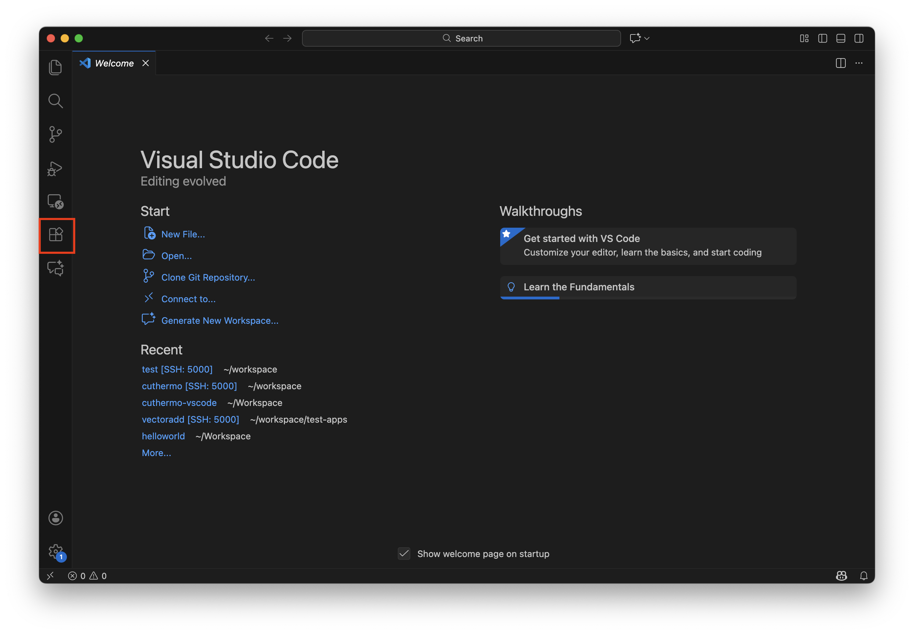
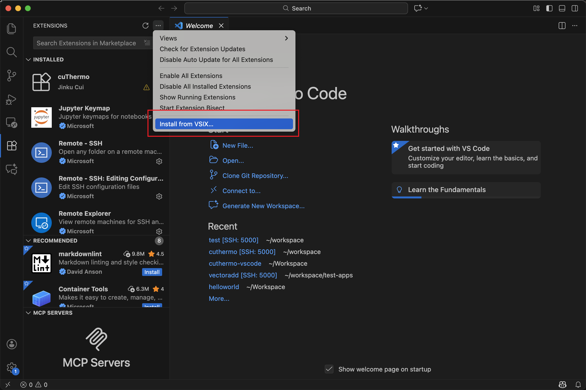
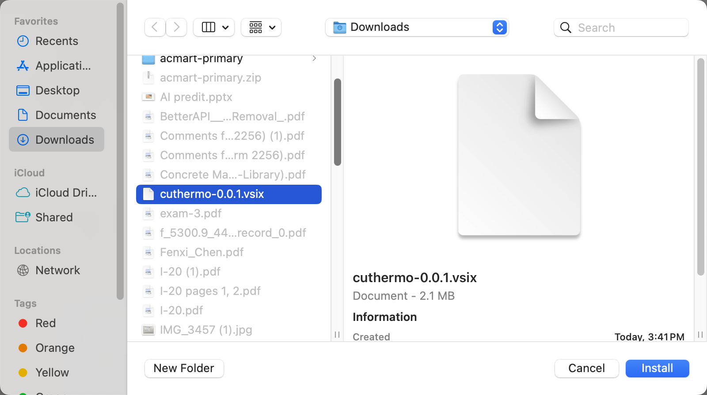
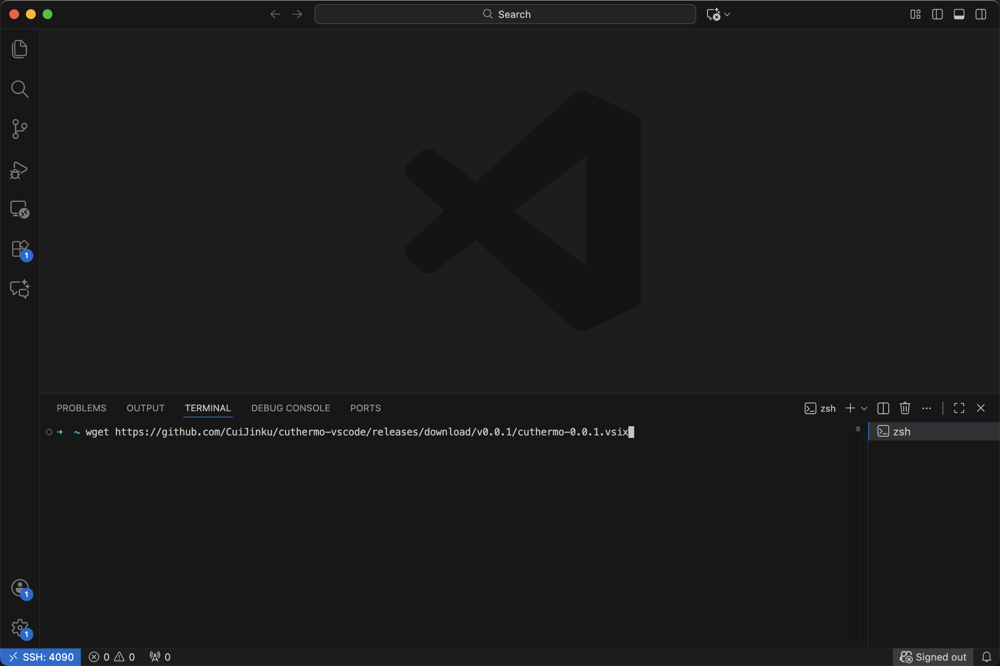
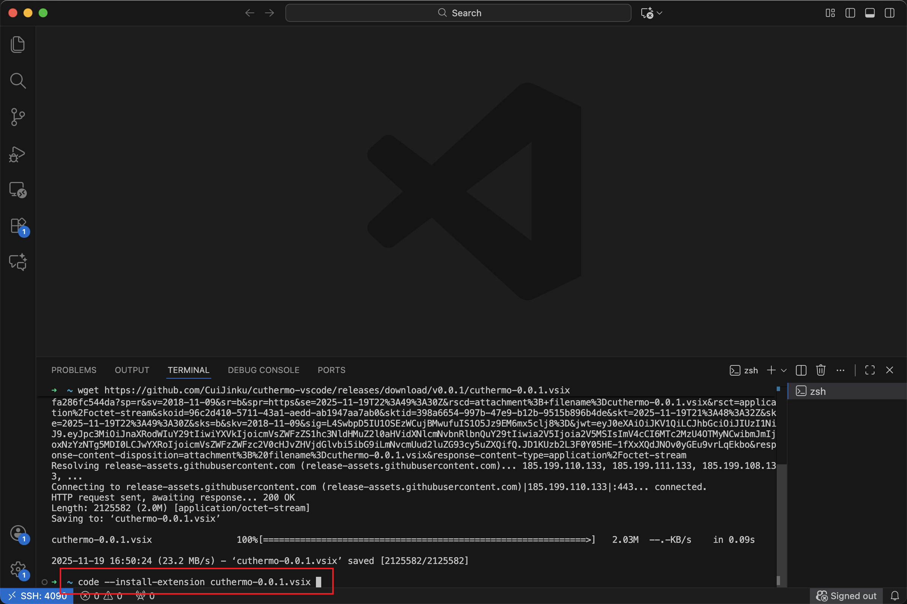
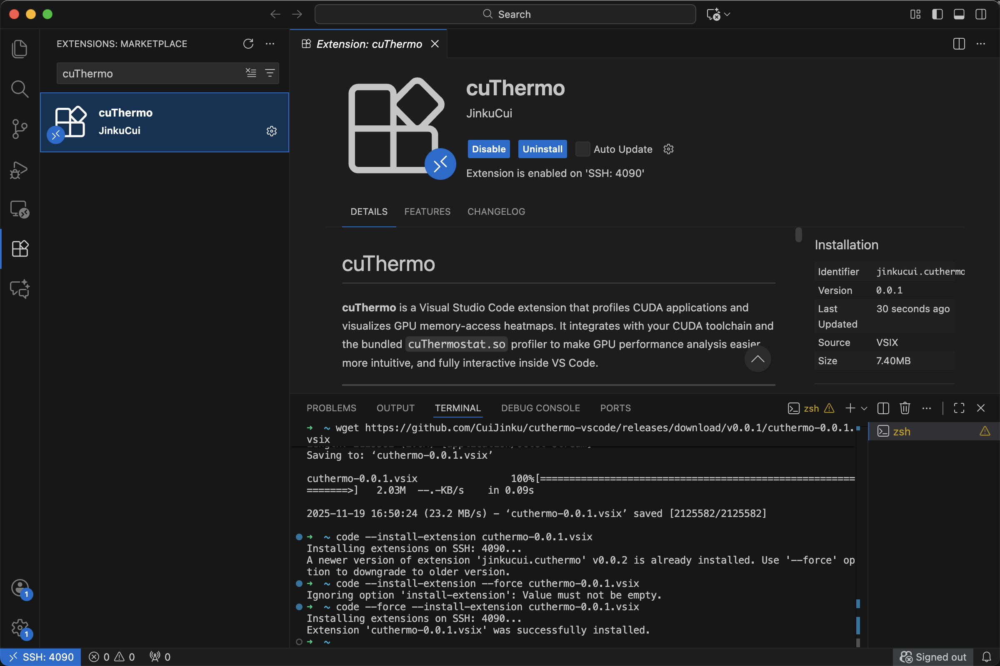

# cuThermo

**cuThermo** is a Visual Studio Code extension that profiles CUDA applications and visualizes GPU memory-access heatmaps. It integrates with your CUDA toolchain and the bundled `cuThermostat.so` profiler to make GPU performance analysis easier, more intuitive, and fully interactive inside VS Code.

---

## 🚀 Features

- **Run GPU profiling directly in VS Code**  
  Invoke *cuThermo: Run on Current Target* to execute the selected CUDA binary and collect memory-access traces.

- **Automatic heatmap visualization**  
  Profiling results are parsed and displayed in a custom WebView panel, showing a live heatmap of memory sector activity.

- **Duplicate-row collapsing**  
  The heatmap applies intelligent preprocessing (same logic as your web-based tool) to compress repetitive frequency rows.

- **Environment validation**  
  Includes a command to check CUDA toolkit, `nvcc`, GPU availability, and the location of `cuThermostat.so`.

- **Configurable executable selection**  
  The extension helps you select which binary to run (e.g., `add`, `matmul`, etc.).

---

## 📦 Requirements

To use cuThermo effectively, your **remote machine (with CUDA)** should have:

- **CUDA Toolkit** (nvcc available in PATH)
- **NVIDIA GPU + driver**
- **cuThermostat.so** (either bundled or installed using the extension command)

Your **local computer** (Mac/Windows/Linux) does **not** need CUDA — it only hosts the editor UI.

Optional but recommended:

- VS Code C++ extension  
- NVIDIA Nsight Systems (for advanced manual analysis)

---

# 📥 Install cuThermo

There are **two cases** depending on whether you use:

1. **VS Code locally** (opening a folder on your machine)  
2. **VS Code Remote-SSH** (connecting to a CUDA server)

---

## 1. Installing locally (simple)

### Step 1 — Download the latest `.vsix`

Latest releases are available at:

👉 https://github.com/CuiJinku/cuthermo-vscode/releases

Download the asset named:

`cuthermo-0.0.X.vsix`

<!-- screenshot: download_vsix_from_releases -->

---

### Step 2 — Install the `.vsix` in VS Code

1. Open the **Extensions** panel.


2. Click the `⋯` (More Actions) button in the top-right.
3. Choose **Install from VSIX…**


4. Select your downloaded `.vsix`.



<!-- screenshot: install_from_vsix_gui -->

---

## 2. Installing on a remote CUDA server (Remote-SSH)

When profiling CUDA kernels, **cuThermo must be installed on the CUDA machine**, not your local laptop.

### Step 1 — SSH into the remote machine

```bash
ssh your_ncsu_id@remote.cluster.edu
```

### Step 2 — Download the cuThermo `.vsix` to the remote machine

Using **wget**:

```bash
wget https://github.com/CuiJinku/cuthermo-vscode/releases/download/v0.0.X/cuthermo-0.0.X.vsix
```



Or using **curl**:

```bash
curl -OL https://github.com/CuiJinku/cuthermo-vscode/releases/download/v0.0.X/cuthermo-0.0.X.vsix
```
(Replace 0.0.X with the latest version.)


<!-- screenshot: terminal_wget_vsix -->

### Step 3 — Install the extension on the remote VS Code server

Once you've connected to the server using Remote-SSH at least once, VS Code Server is installed there.
Then run:

```bash
code --install-extension cuthermo-0.0.X.vsix
```



To update or replace an older version:

```bash
code --uninstall-extension cuthermo
code --install-extension cuthermo-0.0.X.vsix
```
<!-- screenshot: terminal_install_vsix -->

### Step 4 — Verify installation

Inside VS Code (connected via SSH):

* Open the **Extensions** panel

* Look under **Installed (Remote)**

You should see:


<!-- screenshot: extension_list_remote -->