# AccelProf `cuThermo` — Installation and Heatmap Tutorial

This tutorial installs the `cuThermo` branch of **AccelProf**, installs the AccelProf VS Code extension, builds two CUDA examples, generates their heatmap profiling results, and walks through how to inspect those results in VS Code.

The installation script used in this repository is:

```text
install_accelprof_cuthermo.sh
```

---

# 1. Before You Start

This tutorial assumes you are working on a university GPU cluster, most likely through **VS Code Remote SSH**.

Many clusters provide Conda, CUDA, and compilers through **Environment Modules** or **Lmod**. Module names differ between clusters, so the installation script does **not** run `module load` automatically.

Before running the installer, load the Conda and CUDA modules available on your cluster.

Typical examples are:

```bash
module avail
module load conda
module load cuda
```

Some clusters may use different names, for example:

```bash
module load miniconda
module load cuda/13.0
```

If necessary, search for available modules with:

```bash
module avail
module spider conda
module spider cuda
module spider gcc
```

Then verify the required tools:

```bash
conda --version
nvcc --version
gcc --version
g++ --version
```

The installer expects the following commands to be available:

```text
git
find
curl
conda
nvcc
gcc
g++
```

The current setup requires **GCC/G++ 11 or newer**.

---

# 2. Quick Start

Download `install_accelprof_cuthermo.sh` into your workspace.

Give the script executable permission:

```bash
chmod +x install_accelprof_cuthermo.sh
```

You can verify that it is executable with:

```bash
ls
```

The filename will typically be displayed differently by your terminal once the executable bit is set.

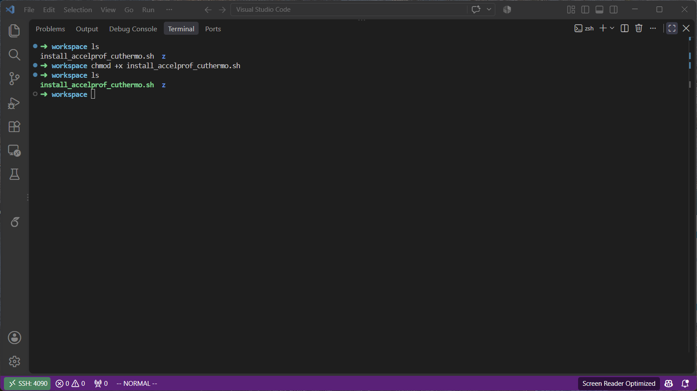

Run the installer using its relative path:

```bash
./install_accelprof_cuthermo.sh
```

> **Do not forget the `./` before the script name.**

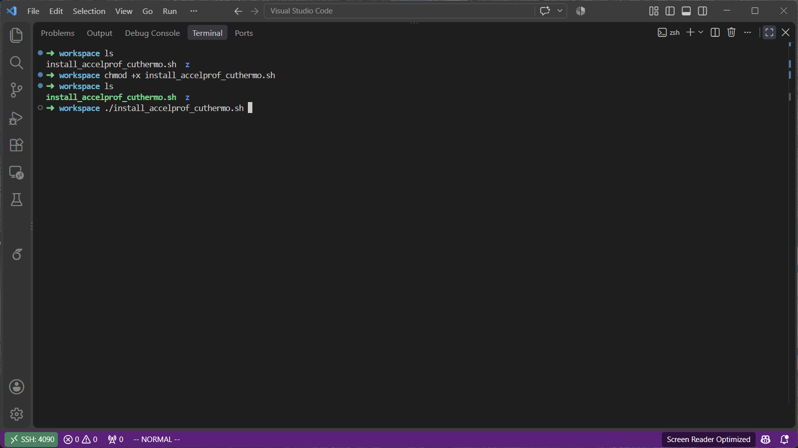

During a normal installation, the script prints progress messages while it checks the compiler, clones repositories, initializes submodules, prepares the Conda environment, installs dependencies, and builds AccelProf.

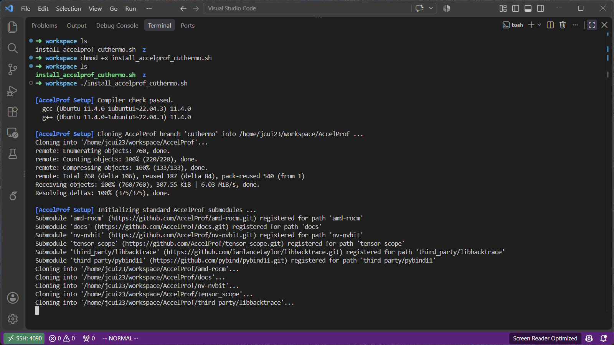

At the end, the script prints a short reference showing how to compile future CUDA programs with line information and how to run the heatmap tool.

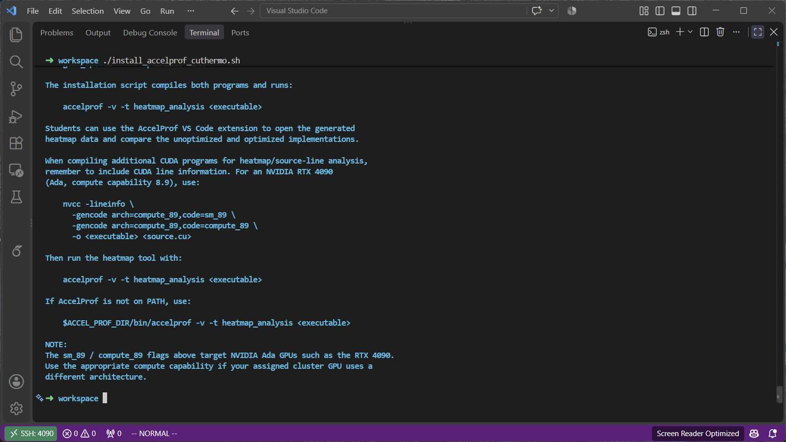

> ## ✅ Installation is DONE!
>
> If the script reaches the final usage hints without an error, **you do not need to perform the build steps later in this README manually**.
>
> Continue directly to the **Heatmap Tutorial** below.
>
> The later **Reference and Troubleshooting** sections only explain what the installer does internally and are intended for debugging if something goes wrong.

---

# 3. Heatmap Tutorial

The installation script automatically prepares two CUDA programs for this tutorial:

- `gemm_naive.cu` — unoptimized version
- `gemm_opt.cu` — optimized version

They come from the following examples:

- [`gemm_naive.cu`](https://github.com/fruitfly1026/parallel-demos/blob/main/Demos/cuda/false_sharing/gemm_naive.cu)
- [`gemm_opt.cu`](https://github.com/fruitfly1026/parallel-demos/blob/main/Demos/cuda/false_sharing/gemm_opt.cu)

The installer also compiles both programs and runs AccelProf's `heatmap_analysis` tool automatically.

## 3.1 Go to the Example Directory

The examples are stored under:

```text
AccelProf/examples/false_sharing/
```

For example:

```bash
cd ~/workspace/AccelProf/examples/false_sharing
ls
```

You should see several types of files:

```text
gemm_naive
gemm_naive.cu
gemm_naive.accelprof.log

gemm_opt
gemm_opt.cu
gemm_opt.accelprof.log

heatmap_gemm_naive_<timestamp>/
heatmap_gemm_opt_<timestamp>/
```

These include CUDA source files, compiled executables, `.accelprof.log` files, and generated heatmap directories.

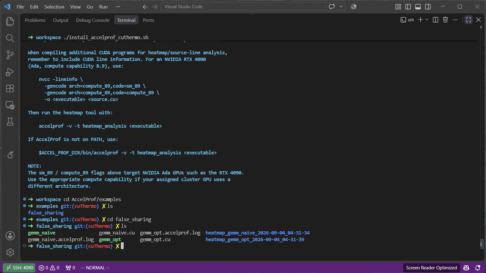

## 3.2 Open the Example Directory in VS Code

From inside `AccelProf/examples/false_sharing`, run:

```bash
code .
```

This opens the current directory in a new VS Code window.

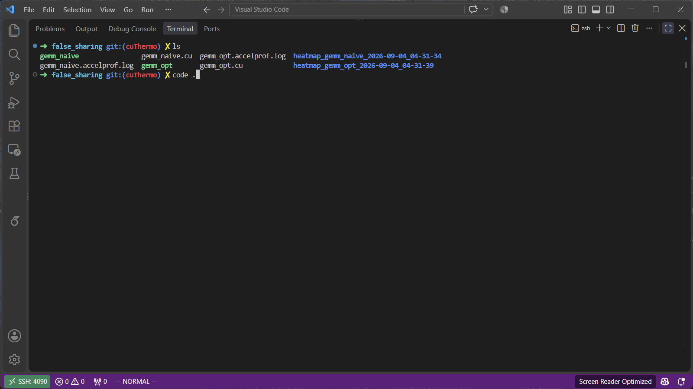

---

# 4. Open the Naive Heatmap

We will first inspect the heatmap generated from:

```text
gemm_naive
```

Expand the directory whose name starts with:

```text
heatmap_gemm_naive_
```

Inside it, you will see files such as:

```text
kernel_0.csv
kernel_1.csv
kernel_2.csv
...
```

## 4.1 Open Heatmap View

Right-click one of the kernel CSV files, such as:

```text
kernel_0.csv
```

Then choose:

```text
Open Heatmap View
```

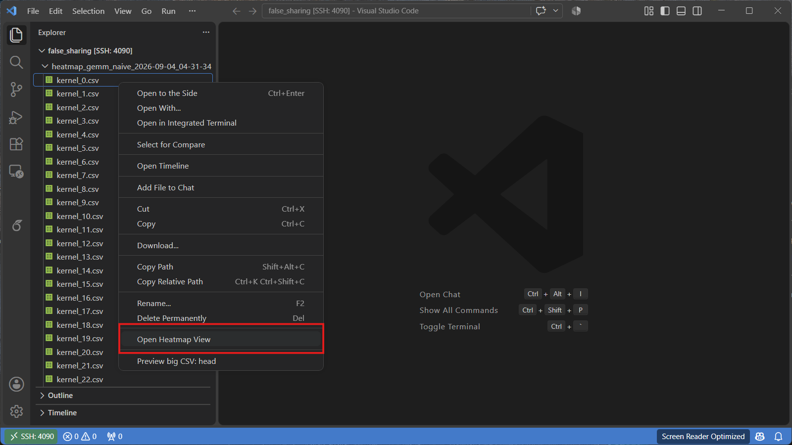

## 4.2 Select the Matching `.accelprof.log`

VS Code will display a prompt:

```text
Select .accelprof.log (Cancel to open heatmap only)
```

The initial path may point inside the heatmap result directory.

If necessary, remove the final heatmap subdirectory from the path so that you return to:

```text
AccelProf/examples/false_sharing/
```

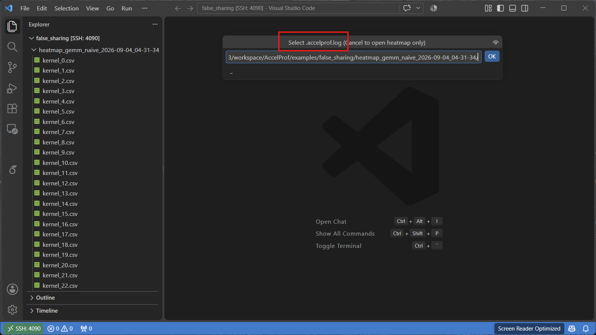

Now select the log file that corresponds to the binary whose heatmap you opened.

For the `gemm_naive` heatmap, choose:

```text
gemm_naive.accelprof.log
```

The binary name is a convenient way to determine which log file matches the heatmap.

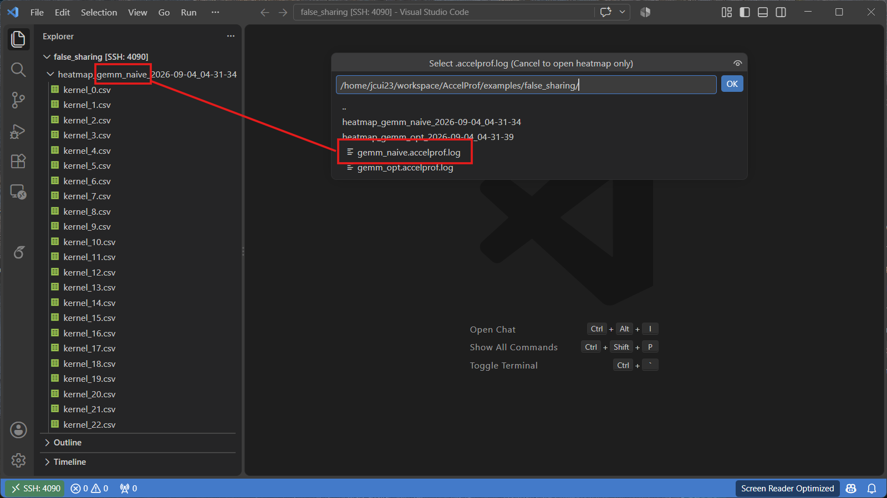

## 4.3 Select the Matching CUDA Binary

Immediately after selecting the log file, VS Code displays another prompt.

This time the title is different:

```text
Select CUDA binary for disassembly
```

This is a **new prompt**. It does not mean your previous log-file selection failed.

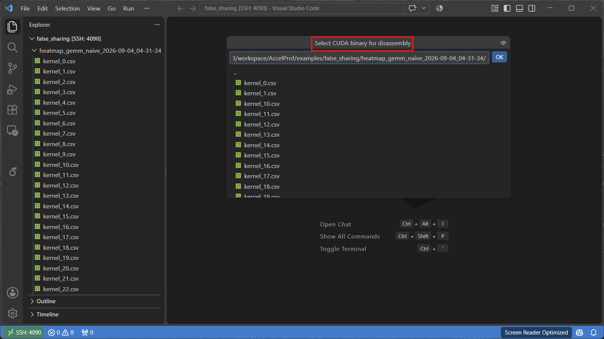

Again, move to:

```text
AccelProf/examples/false_sharing/
```

and choose the matching executable:

```text
gemm_naive
```

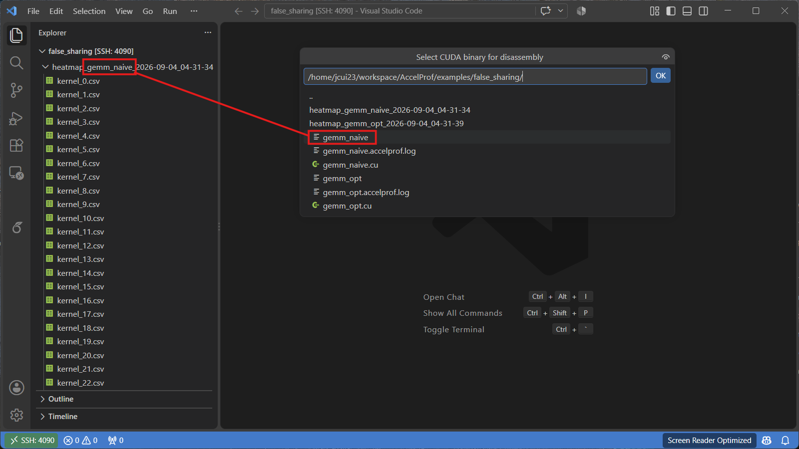

---

# 5. Arrange the Heatmap Workspace

After selecting the binary, VS Code opens the AccelProf Heatmap view and a binary disassembly view.

For easier source-to-assembly mapping, also open:

```text
gemm_naive.cu
```

Drag the source file into the leftmost editor area so that the workspace contains:

```text
CUDA source | disassembly | AccelProf Heatmap
```

After the source file is open, click the **Explorer** icon in the left sidebar to hide the file browser and give the three editor panes more horizontal space.

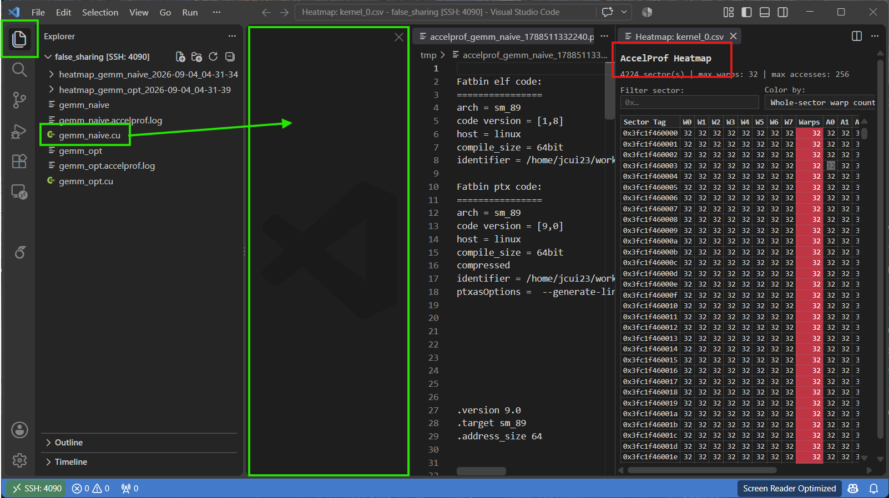

---

# 6. Find an Interesting Memory-Access Pattern

Resize the editor panes so that the Heatmap view has enough horizontal space.

You can scroll horizontally in the Heatmap view to inspect warp-count patterns, access counts, and touched PC addresses.

Look for a pattern that appears interesting or potentially inefficient.

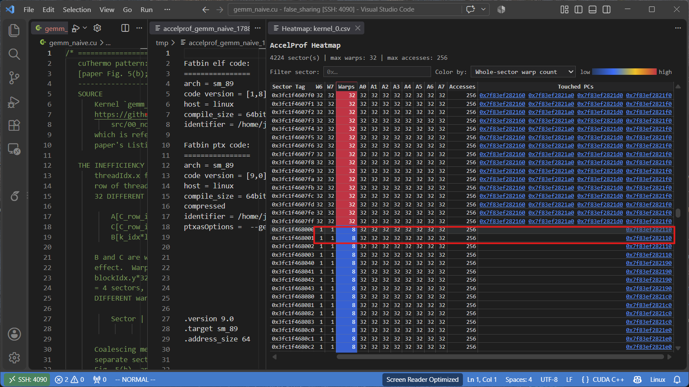

---

# 7. Dynamically Map the Heatmap Back to Source Code

In the Heatmap view, click one of the PC addresses in the **Touched PCs** column.

AccelProf will map that address back through the binary disassembly and source-line information.

The corresponding location becomes highlighted in the disassembly view and the CUDA source view.

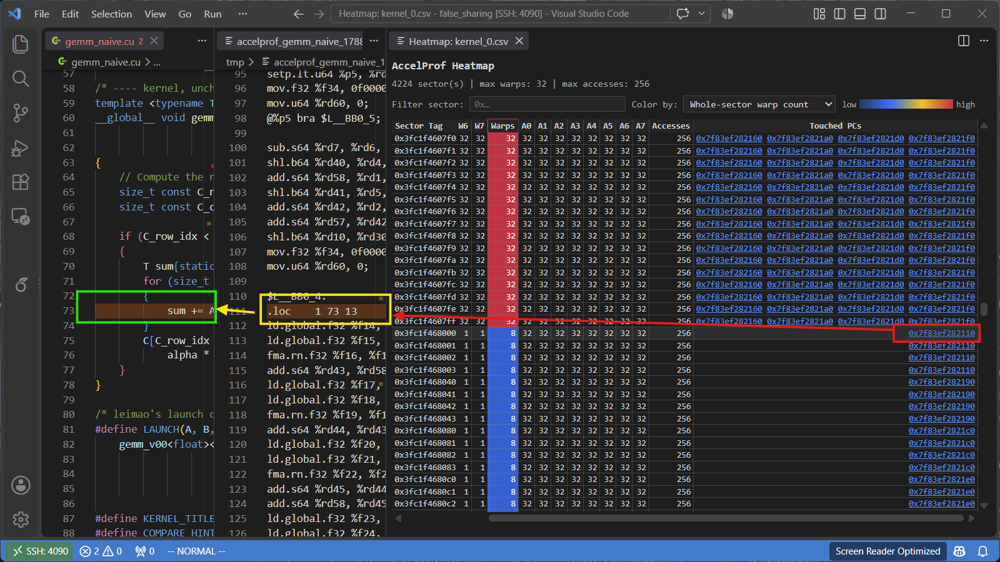

This interactive mapping is why the CUDA programs are compiled with:

```text
-lineinfo
```

---

# 8. Pinpoint a Potential Bottleneck

Resize the source, disassembly, and heatmap panes as needed.

The highlighted source line identifies the CUDA statement associated with the selected PC address and heatmap behavior.

In the naive example, this can help you identify the code region that may offer an optimization opportunity.

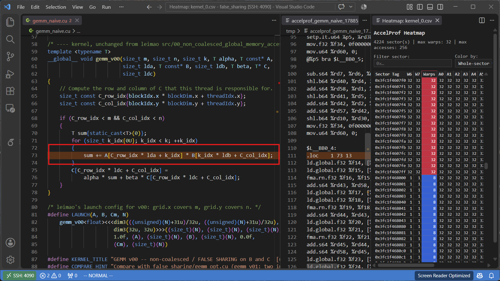

---

# 9. Compare with the Optimized Version

Now repeat the same workflow for:

```text
heatmap_gemm_opt_<timestamp>/
```

Use the matching files:

```text
gemm_opt.accelprof.log
gemm_opt
gemm_opt.cu
```

Open the heatmap, select the matching log and binary, open the source, and inspect the memory-access patterns.

In the optimized version, the heatmap pattern should look noticeably different from the naive implementation. The screenshot below highlights the more regular optimized access pattern used for comparison in this tutorial.

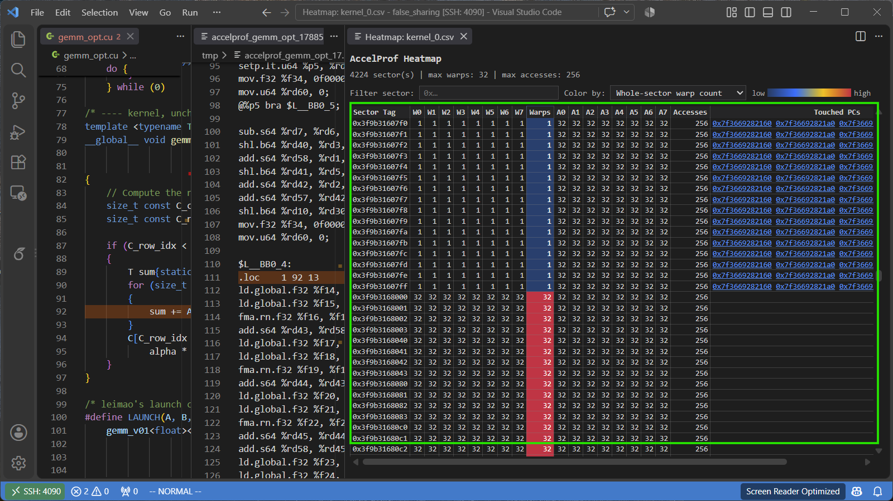

The main goal is to compare:

```text
gemm_naive
      ↓
heatmap + source mapping

versus

gemm_opt
      ↓
heatmap + source mapping
```

and visually connect a CUDA source-level optimization with the corresponding change in GPU memory-access behavior.

---

# 10. Commands to Remember

The installation script already compiles and profiles the two examples for you.

For future CUDA programs, remember these two commands.

## Compile CUDA Code with Line Information

For an NVIDIA RTX 4090 / Ada GPU with compute capability 8.9:

```bash
nvcc -lineinfo \
  -gencode arch=compute_89,code=sm_89 \
  -gencode arch=compute_89,code=compute_89 \
  -o <executable> <source.cu>
```

The important option for source mapping is:

```text
-lineinfo
```

The `sm_89` / `compute_89` values are specific to Ada GPUs such as the RTX 4090. If your cluster assigns a different GPU architecture, use the appropriate compute capability.

## Run AccelProf Heatmap Analysis

Use:

```bash
accelprof -v -t heatmap_analysis <executable>
```

If `accelprof` is not on your `PATH`, use:

```bash
$ACCEL_PROF_DIR/bin/accelprof \
  -v -t heatmap_analysis <executable>
```

---

# 11. Reference and Troubleshooting

> **You do not need to perform the steps in this section if the Quick Start installation completed successfully.**
>
> This section explains what the installation script does internally and provides debugging information if the installation fails.

## 11.1 Important: Do Not Use `git clone --recursive`

Do **not** manually clone the main repository using:

```bash
git clone --recursive ...
```

The upstream `nv-compute` submodule references the unavailable commit:

```text
3b6a80ffdab182ea3fae959c4023dc7a5aa61b1b
```

The installer instead clones the main `cuThermo` branch without `--recursive`, initializes normal submodules, and manually clones the modified `cuThermo` versions of `sanalyzer` and `nv-compute`.

## 11.2 Safe Re-Runs

If `~/workspace/AccelProf` is already a Git repository, it is reused.

Existing Git checkouts of `sanalyzer/` and `nv-compute/` are also reused.

The installer does not automatically delete an existing AccelProf checkout.

## 11.3 Conda and PyTorch

The installer creates a Conda environment named:

```text
accelprof
```

with Python 3.11. If it already exists, it is reused.

PyTorch is installed only if:

```bash
python -c "import torch"
```

fails.

The installer uses:

```bash
python -m pip install --upgrade pip
python -m pip install torch torchvision
```

It also checks for:

```text
ATen/record_function.h
```

before compiling `tensor_scope`.

## 11.4 pip Tries to Access `pypi.ngc.nvidia.com`

Inspect your pip configuration:

```bash
python -m pip config debug
```

Look for `global.extra-index-url` or `global.trusted-host` pointing to `pypi.ngc.nvidia.com`. If that source is unavailable from the cluster, remove or disable those user-level settings before retrying.

## 11.5 GCC and C++20

The installer requires GCC/G++ 11 or newer.

The `cuThermo` `tensor_scope/Makefile` may still contain:

```text
-std=c++17
```

The installer automatically changes it to:

```text
-std=c++20
```

before compiling `tensor_scope`.

## 11.6 `ATen/record_function.h: No such file or directory`

Activate the environment and verify PyTorch:

```bash
conda activate accelprof
python -c "import torch"
```

## 11.7 Errors Mentioning `strong_ordering`, `requires`, `starts_with`, or `ends_with`

These normally indicate that PyTorch C++ headers are being compiled as C++17 instead of C++20.

Verify the compilation command contains:

```text
-std=c++20
```

## 11.8 `torch_scope.h: No such file or directory`

Verify:

```bash
ls "$ACCEL_PROF_DIR/build/tensor_scope/include/torch_scope.h"
```

`nv-compute` depends on this installed header.

## 11.9 Required Shared Libraries

The final installation must contain:

```text
$ACCEL_PROF_DIR/lib/libcompute_sanitizer.so
$ACCEL_PROF_DIR/lib/libnv-nvbit.so
```

If `libcompute_sanitizer.so` cannot be preloaded:

```bash
ls -l "$ACCEL_PROF_DIR/lib/libcompute_sanitizer.so"
ldd "$ACCEL_PROF_DIR/lib/libcompute_sanitizer.so"
```

## 11.10 VS Code Extension

The repository contains:

```text
third_party/accelprof-vscode/accelprof-vscode-0.1.0.vsix
```

The installer attempts:

```bash
code --install-extension \
  "$ACCEL_PROF_DIR/third_party/accelprof-vscode/accelprof-vscode-0.1.0.vsix" \
  --force
```

If the remote shell does not provide `code`, use:

```text
Extensions → Install from VSIX...
```

## 11.11 Example Re-Runs

Existing source files are reused. Existing executables are reused if they are newer than the corresponding source file.

Before generating a fresh pair of teaching heatmaps, the installer removes old outputs matching:

```text
heatmap_gemm_naive_*
heatmap_gemm_opt_*
gemm_naive.accelprof.log
gemm_opt.accelprof.log
```

This keeps the tutorial directory easy to understand.

---

# 12. Installation Workflow Summary

The installer performs the following workflow automatically:

```text
check required tools and compiler
        ↓
clone/reuse AccelProf
        ↓
prepare submodules
        ↓
create/reuse Conda environment
        ↓
install/reuse PyTorch
        ↓
patch tensor_scope to C++20
        ↓
build AccelProf components
        ↓
verify runtime shared libraries
        ↓
install the VS Code extension
        ↓
download/reuse CUDA examples
        ↓
compile/reuse the executables
        ↓
remove old teaching heatmaps
        ↓
generate naive + optimized heatmaps
```

If all of that completes successfully, return to the **Heatmap Tutorial** near the top of this README and focus on interpreting the profiling results rather than rebuilding AccelProf manually.
